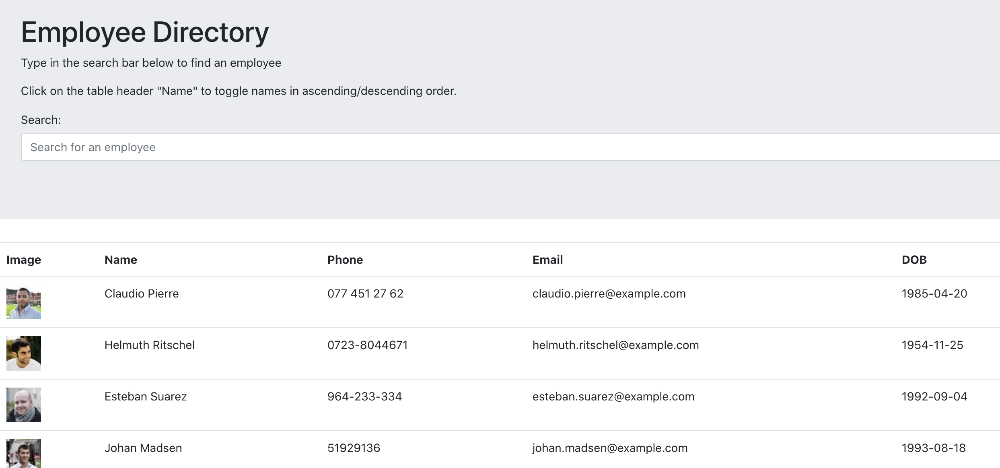
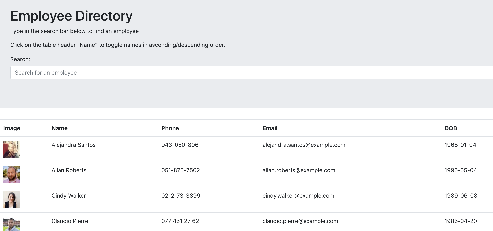
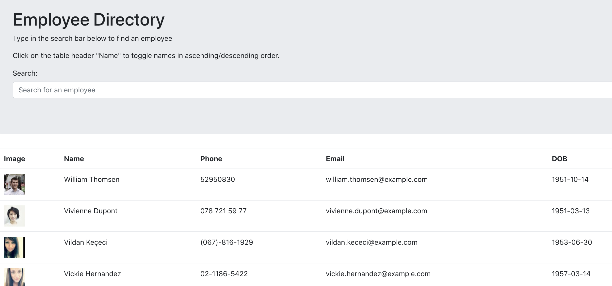
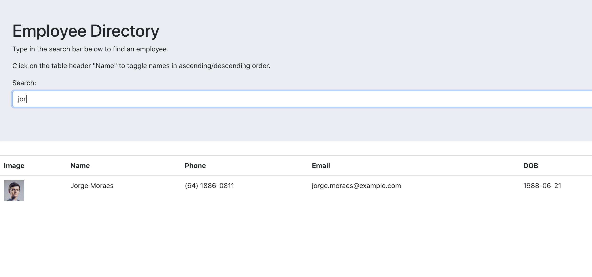

## Employee Directory Landing Page

# Employee Directory 

## Description 
This is a React app that can be used to keep track and find employees or other groups of people in an organization. Various components are used to populate employees, render the header, and put the serach bar in place. It currently has random users but can easily be customized for any organization. A user can filter and search for various employees using different factors. 

## Table of Contents

- [Employee Directory](#employee-directory)
  - [Table of Contents](#table-of-contents)
  - [Installation](#installation)
  - [Usage](#usage)
  - [Links](#links)
  - [Technologies](#technologies)
  - [Contributing](#contributing)
  - [Questions](#questions)

## Installation
1. Download or clone repository
2. `npm install` to install the required npm packages to run

### Usage
- Begin by simply open it to see the list of employees. 
- To find a particular employee, type in the serach bar to search the names, phone numbers, and emails all at once. 
- Additionally, if the user want to organize the employees by name, they can click on the name header to sort A-Z by first name and click again to toggle to a Z-A sort. 

### Screenshots
#### Opening page:

#### Name Sorted A-Z:

#### Name Sorted Z-A:

#### Search Demonstrarted:

### Links
 - [Github](https://github.com/gtscott90/employee-tracker)
 - [Deployed App](https://gtscott90.github.io/employee-directory/)
 
 ## Technologies

 - React
 - React Hooks
 - Axios 
 - Random User API
 - JavaScript

## Contributing

@gtscott90

## Questions

Check out my other repositories in the link below:

- [GitHub Profile](https://github.com/gtscott90)

- For any additional questions, please [email](mailto:gtscott90@gmail.com) me.
